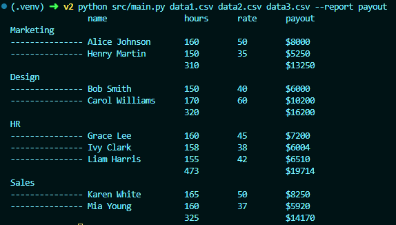
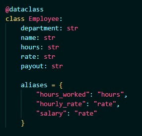

# Скрипт формирующий отчетность из csv файлов.

Работа со скриптом ведеться из корневой директории

## Установка зависимостей:

```
pip install -r requirements.txt
```

## Пример запуска:

`python src/main.py data1.csv data2.csv data3.csv --report payout`

Результат:



## Описание

Так как название колонок в csv файлах может меняться, для удобства функционал реализован с помощью dataclass:



В нем описываются выводимые в отчете поля и алиасы (варианты наименований полей), забор данных из csv и формирование объектов dataclass происходит на основании этих полей и алиасов.

Для расширения функциональности (добавления нового отчета) нужно создать новый dataclass, метод вывода отчета (по аналогии с print_payout_report) и дописать условие в функции main. Также возможно понадобиться написать метод по аналогии с get_employees или незначительно его доработать чтобы он стал универсальным.
